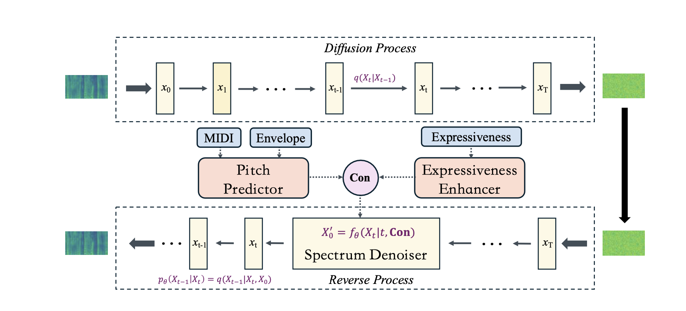
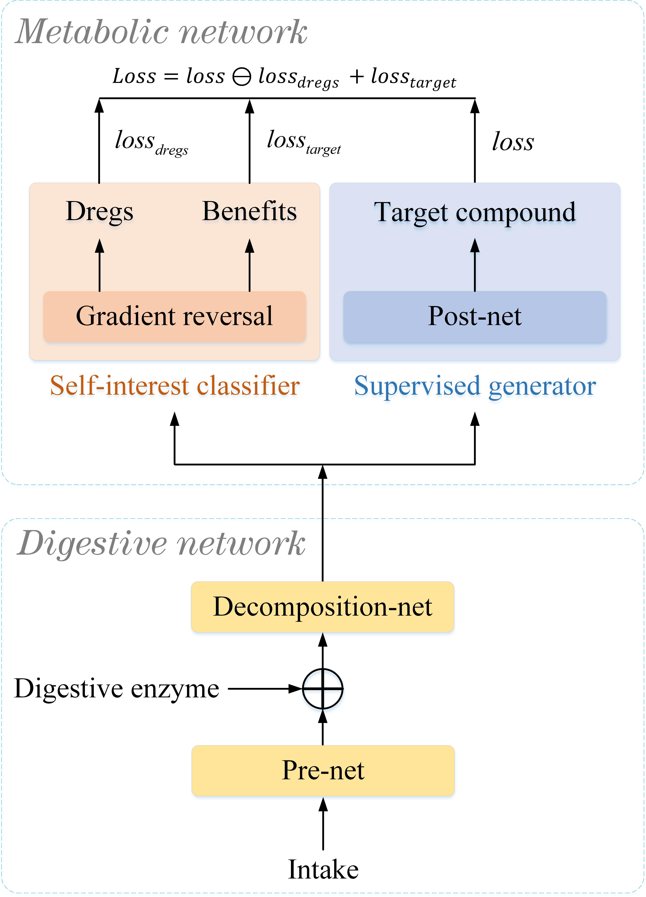
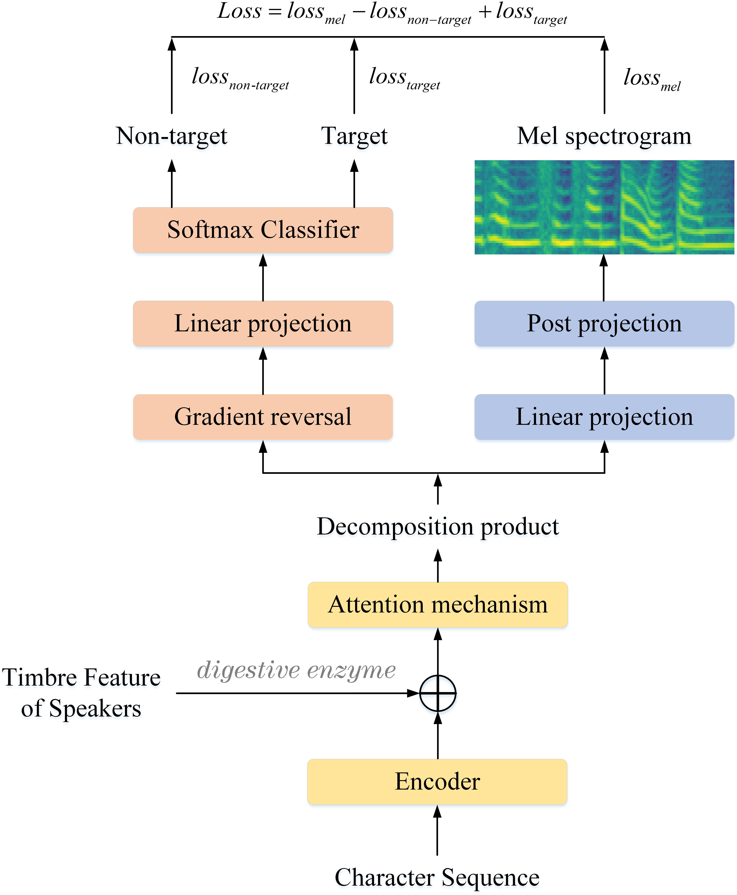

# ConTuner

## Overview

Singing voice beautifying (SVB) is a novel task that is widely used in practical scenarios. SVB task aims to correct the pitch of the singing voice and improve the expressiveness without changing the timbre and content. The major challenge of SVB is that paired data of professional songs and amateur songs is hard to obtain and we solved it for the first time. In this paper, we propose ConTuner, an efficient diffusion model for highfidelity Singing Voice Beautifying. Since there are no paired data, diffusion model is adapted as our backbone, which is combined with modified conditions to generate our mel-spectrograms. We also reduce the number of steps of sampling t by using generator-based methods. For automatic pitch correction, we establish a mapping relationship from MIDI, spectrum envelope to pitch. To make amateur singing more expressive, we propose an expression enhancer in the latent space to convert the amateur vocal tone to the professional one. Furthermore, we produced a 40-hour singing dataset that contains original song vocals and extremely amateurish samples to promote the development of SVB. ConTuner achieves a state-of-the-art beautification effect on both English and Chinese songs. Our extensive ablation study demonstrates that expression part and generator-based methods in ConTuner are effective.

## Model Architecture

 

Figure.1 The overall architecture of ConTuner.

<!-- 	(B) The detailed architecture of the Mel Spectrogram Denoiser.
 -->

<!-- ### General Digestive Metabolic Network

Figure.1 The architecture of the general digestive metabolic network.

### Functional Digestive Metabolic Network

Figure.2 The architecture of the functional digestive metabolic network.
 -->

## Singing Audio Samples
There are four models in total: [1] GTMel, amateur (A) and [2] professional (P) version, where we first convert ground truth audio into mel-spectrograms, and then convert the mel-spectrograms back to audio according via the vocoder. [3] *w/o* Expressiveness Enhancer, remove expressive enhancer from ConTuner, which means that *pitch predictor* takes part in the beautifying. [4] ConTuner, the model proposed. 

*All four models have a slight electrical sound because of our vocoder Griffin-Lim. Please pay more attention to the pitch and expressiveness of songs.*

## Chinese

<!-- 
&nbsp;
  -->

&nbsp;
 
I. 在我心中曾经有一个梦(zai wo xin zhong ceng jing you yi ge meng) 
<table>
<!-- 	<CAPTION class="text-left">1.在我心中曾经有一个梦</CAPTION> -->
    <tr>
        <th></th>
	<th> GT Amateur</th>
        <th> GT Profession</th>
        <th> w/o Expressiveness Enhancer</th>
	<th> ConTuner</th>
    </tr>
    <tr>
        <th> wav </th>
	<th> <audio controls id="player" onplay="pauseOthers(this);"><source src="assets/audios/ConTuner/8diff.wav" type="audio/mpeg"></audio> </th>
        <th> <audio controls id="player" onplay="pauseOthers(this);"><source src="assets/audios/ConTuner/8ori.wav" type="audio/mpeg"></audio> </th>
        <th> <audio controls id="player" onplay="pauseOthers(this);"><source src="assets/audios/ConTuner/8p.wav" type="audio/mpeg"></audio> </th>
        <th> <audio controls id="player" onplay="pauseOthers(this);"><source src="assets/audios/ConTuner/8ama.wav" type="audio/mpeg"></audio> </th>
    </tr>	
</table>

II. 你总说毕业遥遥无期转眼就各奔东西(ni zong shuo bi ye yao yao wu qi zhuan yan jiu ge ben dong xi) 
<table>
    <tr>
        <th></th>
	<th> GT Amateur</th>
        <th> GT Profession</th>
        <th> w/o Expressiveness Enhancer</th>
	<th> ConTuner</th>
    </tr>
    <tr>
        <th> wav </th>
	<th> <audio controls id="player" onplay="pauseOthers(this);"><source src="assets/audios/ConTuner/12ama.wav" type="audio/mpeg"></audio> </th>
        <th> <audio controls id="player" onplay="pauseOthers(this);"><source src="assets/audios/ConTuner/12ori.wav" type="audio/mpeg"></audio> </th>
        <th> <audio controls id="player" onplay="pauseOthers(this);"><source src="assets/audios/ConTuner/12p.wav" type="audio/mpeg"></audio> </th>
        <th> <audio controls id="player" onplay="pauseOthers(this);"><source src="assets/audios/ConTuner/12diff.wav" type="audio/mpeg"></audio> </th>
    </tr>	
</table>

III. 明天你是否还惦记曾经最爱哭的你(ming tian ni shi fou hai dian ji zhe ceng jing zui ai ku de ni) 
<table>
    <tr>
        <th></th>
	<th> GT Amateur</th>
        <th> GT Profession</th>
        <th> w/o Expressiveness Enhancer</th>
	<th> ConTuner</th>
    </tr>
    <tr>
        <th> wav </th>
	<th> <audio controls id="player" onplay="pauseOthers(this);"><source src="assets/audios/ConTuner/11ama.wav" type="audio/mpeg"></audio> </th>
        <th> <audio controls id="player" onplay="pauseOthers(this);"><source src="assets/audios/ConTuner/11ori.wav" type="audio/mpeg"></audio> </th>
        <th> <audio controls id="player" onplay="pauseOthers(this);"><source src="assets/audios/ConTuner/11p.wav" type="audio/mpeg"></audio> </th>
        <th> <audio controls id="player" onplay="pauseOthers(this);"><source src="assets/audios/ConTuner/11diff.wav" type="audio/mpeg"></audio> </th>
    </tr>	
</table>

## English

&nbsp;
 
IV. Because when the sun shines, we’ll shine together. Told you I'll be here forever 
<table>
    <tr>
        <th></th>
	<th> GT Amateur</th>
        <th> GT Profession</th>
        <th> w/o Expressiveness Enhancer</th>
	<th> ConTuner</th>
    </tr>
    <tr>
        <th> wav </th>
	<th> <audio controls id="player" onplay="pauseOthers(this);"><source src="assets/audios/ConTuner/14ama.wav" type="audio/mpeg"></audio> </th>
        <th> <audio controls id="player" onplay="pauseOthers(this);"><source src="assets/audios/ConTuner/14ori.wav" type="audio/mpeg"></audio> </th>
        <th> <audio controls id="player" onplay="pauseOthers(this);"><source src="assets/audios/ConTuner/14p.wav" type="audio/mpeg"></audio> </th>
        <th> <audio controls id="player" onplay="pauseOthers(this);"><source src="assets/audios/ConTuner/14diff.wav" type="audio/mpeg"></audio> </th>
    </tr>	
</table>

V. I said, no one has to know what we do 
<table>
    <tr>
        <th></th>
	<th> GT Amateur</th>
        <th> GT Profession</th>
        <th> w/o Expressiveness Enhancer</th>
	<th> ConTuner</th>
    </tr>
    <tr>
        <th> wav </th>
	<th> <audio controls id="player" onplay="pauseOthers(this);"><source src="assets/audios/ConTuner/20ama.wav" type="audio/mpeg"></audio> </th>
        <th> <audio controls id="player" onplay="pauseOthers(this);"><source src="assets/audios/ConTuner/20ori.wav" type="audio/mpeg"></audio> </th>
        <th> <audio controls id="player" onplay="pauseOthers(this);"><source src="assets/audios/ConTuner/20p.wav" type="audio/mpeg"></audio> </th>
        <th> <audio controls id="player" onplay="pauseOthers(this);"><source src="assets/audios/ConTuner/20diff.wav" type="audio/mpeg"></audio> </th>
    </tr>	
</table>

VI. Said I'll always be a friend, took an oath. I'am stick it out till the end 
<table>
    <tr>
        <th></th>
	<th> GT Amateur</th>
        <th> GT Profession</th>
        <th> w/o Expressiveness Enhancer</th>
	<th> ConTuner</th>
    </tr>
    <tr>
        <th> wav </th>
	<th> <audio controls id="player" onplay="pauseOthers(this);"><source src="assets/audios/ConTuner/15ama.wav" type="audio/mpeg"></audio> </th>
        <th> <audio controls id="player" onplay="pauseOthers(this);"><source src="assets/audios/ConTuner/15ori.wav" type="audio/mpeg"></audio> </th>
        <th> <audio controls id="player" onplay="pauseOthers(this);"><source src="assets/audios/ConTuner/15p.wav" type="audio/mpeg"></audio> </th>
        <th> <audio controls id="player" onplay="pauseOthers(this);"><source src="assets/audios/ConTuner/15diff.wav" type="audio/mpeg"></audio> </th>
    </tr>	
</table>

